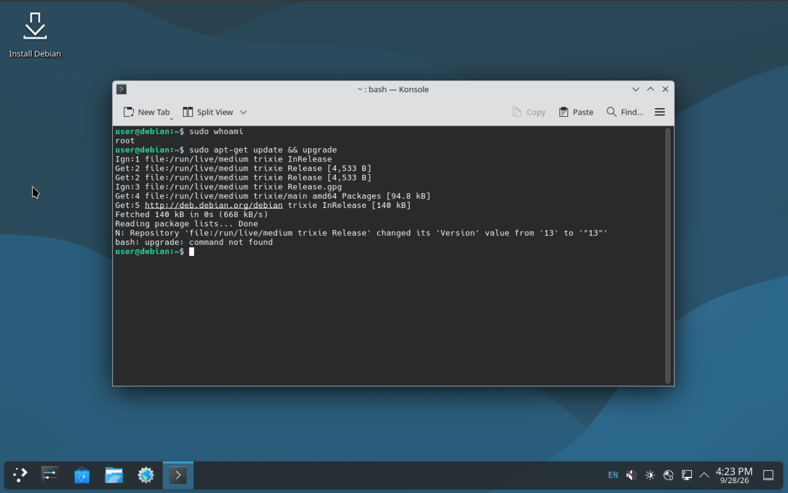
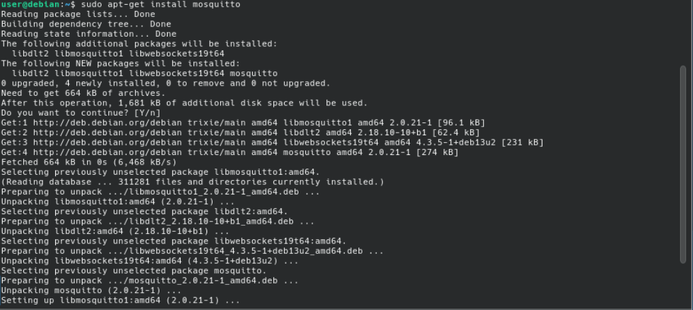
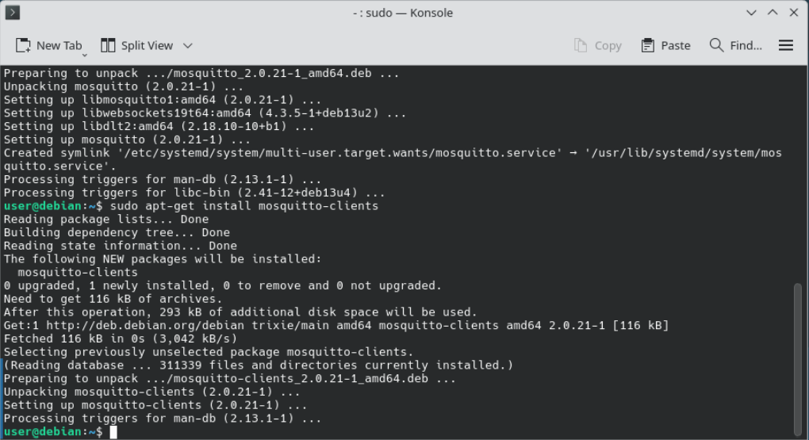
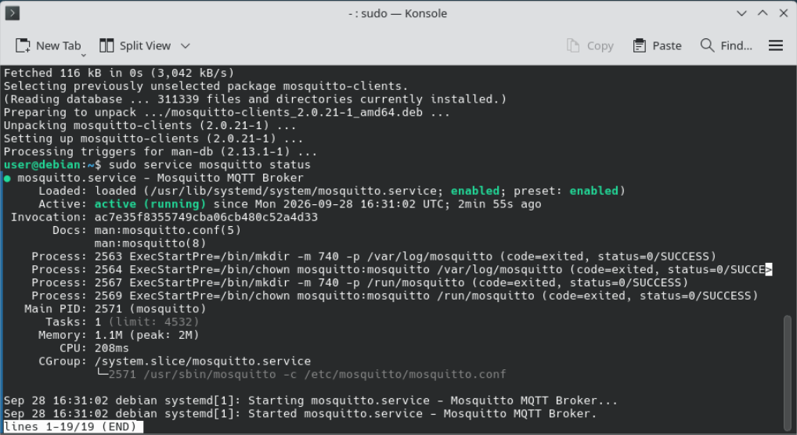
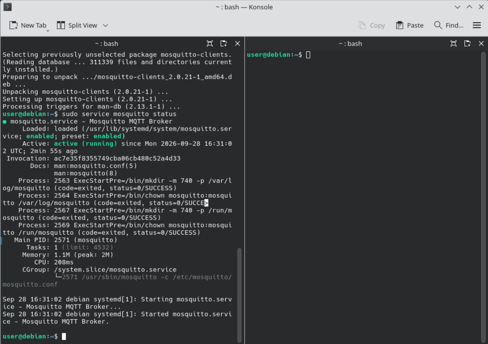
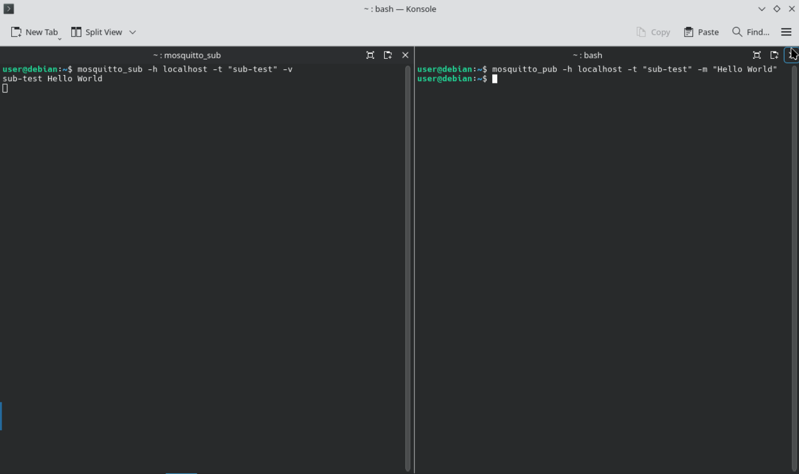

# Installing the Mosquitto MQTT Broker on Debian

## Goal

This guide installs and tests a Mosquitto MQTT broker on Debian. It recreates the deployment I did in high school for a PNRR-funded IoT prototype, where the broker ran on a Raspberry Pi.

The original document is no longer available, so every step here was redone from scratch.

## Requirements

- **A Debian machine.** I used a Debian virtual machine on my NAS instead of the original Raspberry Pi. Raspberry Pi OS is based on Debian, so the steps are the same.
- **A user with `sudo` privileges.**
- **An up-to-date system.** Update the package list and installed packages first:

```bash
sudo apt update && sudo apt upgrade
```



## Installation

The installation takes two packages and one check.

**1. Install the broker** from Debian's official repositories. Press `Y` or Enter to confirm.

```bash
sudo apt install mosquitto
```



**2. Install the command-line clients.** They are optional, but recommended: they let you test the broker from the same machine.

```bash
sudo apt install mosquitto-clients
```



**3. Check that the broker is running** in the background:

```bash
sudo service mosquitto status
```

The output should show `Active: active (running)`.



## Testing

The test sends a message from a publisher to a subscriber through the broker, all on the same machine (`localhost`). You need two terminals: I split the Konsole window (KDE) into two views, but any two terminal windows work.



**Terminal 1 — subscriber.** Subscribe to a test topic. The `-v` option prints the topic name next to each message.

```bash
mosquitto_sub -h localhost -t "sub-test" -v
```

**Terminal 2 — publisher.** Publish a message on the same topic:

```bash
mosquitto_pub -h localhost -t "sub-test" -m "Hello World"
```

The subscriber should print:

```
sub-test Hello World
```

The topic name is arbitrary: `sub-test` is just a simple example.



## Notes and limitations

- **Localhost only.** This recreation tests the broker on a single machine. In the original prototype, the devices connected to the broker over the network.
- **Virtual machine instead of a Raspberry Pi.** The commands are the same, but performance and networking may differ from the original hardware.

**Connecting a device over Wi-Fi.** In my first version of the device code (for an ESP-01), the Wi-Fi network name (SSID), its password and the broker address are read from a separate `secrets.h` file. To connect a device, fill in your own values:

```cpp
// secrets.h: keep this file private and never upload it to GitHub
#define SECRET_SSID   "your-network-name"     // primary Wi-Fi network (SSID)
#define SECRET_PASS   "your-password"
#define SECRET_SSID2  "backup-network-name"   // fallback network
#define SECRET_PASS2  "backup-password"
#define BROKER_Server "server-address"        // IP address of the Debian machine
#define BROKER_Port   1883                    // default MQTT port
#define BROKER_Topic  "your-topic"
```

For the device to reach the broker, the broker must also accept connections from the network, which this guide does not cover yet.
